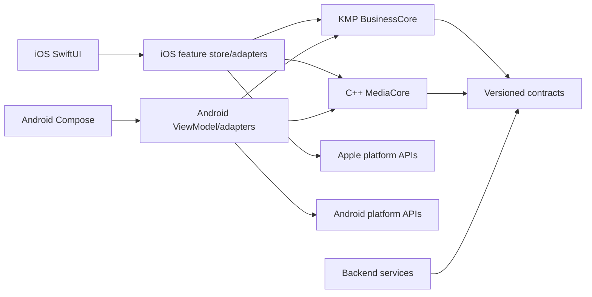

# Repository and Code Architecture

## 1. Architectural objective

Make product behavior identical where it must be shared and native where the operating system matters. Dependency direction points toward stable domain contracts; side effects point outward through ports.



BusinessCore and MediaCore do not depend on application UI or each other.

## 2. Ownership boundaries

| Layer                      | Owns                                                                                                      | Does not own                                                             |
| -------------------------- | --------------------------------------------------------------------------------------------------------- | ------------------------------------------------------------------------ |
| Native presentation        | Layout, navigation, focus, gestures, accessibility, permission UI, transient state                        | Protocol rules, signing order, ranking formulas                          |
| Native adapter/application | Task/scope lifetime, repositories, database transactions, OS effects, BusinessCore/MediaCore bridging     | Cross-platform rule duplication                                          |
| BusinessCore               | Value types, Nostr codecs, reducers, validation, ranking, moderation, Studio semantics, publish decisions | UI, OS objects, secrets, decoded media, sockets/database implementations |
| MediaCore                  | Timeline math, scene/audio/render graph, deterministic media evaluation                                   | Nostr, keys, wallet, network, product navigation                         |
| Backend                    | Rebuildable projection, search, candidate generation, jobs, moderation operations                         | Canonical identity/post ownership or private keys                        |
| Contracts                  | Schemas, event fixtures, API descriptions, render goldens                                                 | Runtime side effects                                                     |

## 3. Dependency rules

Allowed:

```text
Feature UI -> feature store -> BusinessCore use case/reducer
Feature store -> native repository adapter -> OS/database/network
Feature store -> media adapter -> MediaCore
Backend transport -> application use case -> projection/queue port
```

Forbidden:

```text
View -> SQL/WebSocket/Keychain/Keystore/C++ handle
BusinessCore -> SwiftUI/Compose/AVFoundation/Media3/Room/URLSession
MediaCore -> BusinessCore/Nostr/HTTP/database
Backend -> creator signing key
Feature A implementation -> Feature B private storage class
```

CI should eventually enforce these with module visibility and dependency analysis. Code review enforces them immediately.

## 4. Feature structure

iOS:

```text
Features/Publish/
├── PublishView.swift
├── PublishStore.swift
├── PublishViewState.swift
└── PublishAccessibility.swift
Platform/Publish/
├── IOSPublishJobStore.swift
├── BackgroundUploadAdapter.swift
└── BusinessPublishBridge.swift
```

Android:

```text
feature/publish/
├── PublishRoute.kt
├── PublishScreen.kt
├── PublishViewModel.kt
└── PublishUiState.kt
core/publish/
├── AndroidPublishJobStore.kt
├── UploadWorker.kt
└── BusinessPublishBridge.kt
```

BusinessCore:

```text
publish/
├── PublishState.kt
├── PublishAction.kt
├── PublishEffect.kt
├── PublishReducer.kt
├── PublishPolicy.kt
└── PublishReducerTest.kt
```

Create a module/package when it establishes a real visibility or build boundary. Do not create a module for every three-line model.

## 5. SRP applied to BitOS

One type, one reason to change:

- `BitzEventCodec`: NIP-71 representation changes.
- `PublishReducer`: legal publish transitions change.
- `BackgroundUploadAdapter`: OS background transfer behavior changes.
- `BlossomClient`: Blossom HTTP contract changes.
- `ProjectRepository`: local atomic persistence changes.
- `MediaRenderAdapter`: BusinessCore/MediaCore mapping changes.
- `FeedRanking`: ranking policy changes.
- `HomeView`: Home presentation changes.

Do not create `BitzManager`, `AppService`, `MediaHelper` or `NostrUtils`. Those names hide multiple reasons to change.

## 6. State and side effects

Business state uses action -> reducer -> new state + effects:

```text
user/native callback
    -> typed action
    -> pure BusinessCore reducer
    -> persist new revision
    -> execute emitted effect in native adapter
    -> dispatch typed result
```

Rules:

- Persist the new durable job state before starting a non-idempotent effect.
- Every effect carries an idempotency/input hash.
- Native feature stores own cancellation and lifecycle.
- Ignore stale effect results using job/project revision tokens.
- UI derives buttons/progress from state; it does not infer the state machine.
- Top-level shells observe only navigation/theme and scalar badge projections;
  destination payloads (feed notes, profiles, threads and player bindings) are
  collected inside the destination that renders them. A relay update must not
  invalidate the whole tab scaffold.

### 6.1 Relay request lifecycle

One-shot REQs (account heads, thread fetches) sent while no relay socket is
open are dropped by the transport and never re-delivered. Two shared,
pure policies in BusinessCore own recovery and both native stores must
schedule identical behavior:

- `EmptyFeedRetry`: the feed window re-subscribes on a capped exponential
  backoff while empty and a relay is connected.
- `AccountBootstrap`: the account-scoped heads (own kind-0 profile, kind-3
  contact list, NIP-51 bookmark/block lists) re-issue while unresolved,
  bounded per connectivity episode; growing relay connectivity opens a new
  episode, and a resolved head is never re-asked.

The cold-start race they cover: an account becomes active (identity loads
from secure storage) before any websocket finishes connecting, so the
first account heads are silently lost and the You surface would stay
anonymous with an empty follow set.

Stories use the same connected-relay retry rule. The native stories adapter
issues one account/following-scoped request and one bounded, relay-wide public
discovery request (20 kind-30315 events). Both still pass the verified-frame
gate; events from followed authors remain in the social lane, while other
authors are projected separately as public discovery cards.

Since the 2026-09 identity rework (performance audit R13), iOS cold start
no longer blocks on identity: `IdentityStore.init` renders the active
registry row as a provisional account (public projection only) and
`RootView` verifies it asynchronously (`restoreActiveSession`: Keychain
load on the actor, secp256k1 derive off-main, epoch-guarded). The shell
fan-out above therefore fires on the provisional account and self-corrects
when restore replaces or clears it — the same `.task(id: pubkey)` race
window, now explicitly bounded by the registry pointer.

### 6.2 Profile / "You" content and follow-scope rules (2026-09 audit)

- The You tabs (Notes · Replies · Bitz) come from a dedicated author-scoped
  REQ (`authorRequest`: kind-0 head + split media/text filters on
  `authors:[me]`), never from filtering the Home feed window — the Home
  head window is global and the Following lane is follow-filtered, so a
  Home-derived own-profile projection undercounts and empties. Android
  uses a dedicated `ownAuthorRepository` so the shared author sheet/page
  cannot clobber the You tab's REQ mid-composition; iOS uses a
  ProfileView-local `AuthorStore`. Reposts (kind 6) remain a best-effort
  projection of the feed window until an author-scoped kind-6 REQ exists.
- Entering You re-issues the active account's kind-0 and kind-3 heads on
  both platforms. This is a manual recovery path for a one-shot bootstrap
  REQ that was sent before any relay socket opened; kind-3 remains the sole
  canonical source for the Following count and connections list.
- Followers are a DERIVED projection, never canonical: a one-shot
  `{"kinds":[3],"#p":[me]}` REQ (shared `FollowerIndex`, page limit 400)
  returns other authors' contact lists, and the newest-head-per-follower
  rule reconciles them — a newer list without our p-tag is an unfollow. The
  You stat row renders that count, the Followers sheet lists those pubkeys
  with the same kind-0 profile fan-in as Following, and the sheet footnotes
  that other relays may know more. The set is scoped per identity: account
  activation clears and re-requests it alongside the other account heads.
- Because top-level tabs stay mounted after their first visit, tapping the
  Following stat also re-issues the account heads. Accepting a kind-3 publishes
  `followingResolved` and its follow set together so UI never observes a
  resolved-but-stale zero projection.
- Native relay consumers register their verified-frame stream before sockets
  start or REQs are sent. Fast head responses must have a consumer/buffer at
  the instant they arrive; otherwise a valid kind-3 can disappear between
  transport startup and feature-store collection.
- Author pages and You surface an explicit Retry on an empty tab:
  `retryFirstPage()` re-issues the first page because a timed-out page is
  not proof of exhaustion (same rule as the feed's older-walk).
- One-shot lookup REQs (profile batches, fallbacks, following-profiles)
  are CLOSEd ~5 s after issue, and a batch whose primary + fallback both
  failed is removed from `requestedProfiles` so a later enqueue retries
  instead of rendering "Anonymous" for the session.
- The Following backwards walk is author-scoped
  (`BitzTimelinePolicy.batchFilters(until, authors)`, chunked ≤100 per
  filter because relays cap author-array length); the global walk wasted
  its 6-batch budget on unrelated events filtered client-side.
- `ContactList.MAX_FOLLOWS` is 250 — just below the codec's 256-tag bound
  so any accepted kind-3 parses in full and a follow/unfollow republish
  never drops parsed follows.
- REQ filters are ALWAYS built by the shared bridge/codec — never
  hand-concatenated JSON. Android once assembled `{"kinds":[3],
"authors":[<pubkey>]}` with unquoted string values (and double-opened the
  following filter's author array): the frame is invalid JSON, relays drop
  it SILENTLY, and the You Following count froze at zero while
  profile/notes/follower REQs (built correctly) kept working. The
  adapter-contract tests therefore assert the exact quoted wire form
  (`"authors":["<hex>"]`), not just substring presence.

## 7. Composition roots

Construct dependencies once at the app/service boundary:

- iOS: `AppEnvironment.live()`.
- Android: application-level dependency container passed to ViewModel factories; replace with a DI tool only when constructor wiring becomes materially difficult.
- Services: process entry point creates config, telemetry, database, queue and use cases.

Dependencies are explicit constructor parameters. Tests replace ports with focused fakes. Avoid service locators and mutable global singletons.

## 8. Data ownership

- Nostr event: canonical after ID/signature verification.
- Media blob: canonical by SHA-256 hash; URLs are locations.
- Backend row: rebuildable projection unless explicitly operational.
- Draft/project/watch state: device-local by default.
- Publish job: durable local operational state.
- Queue/cache: never the only copy of accepted work.

Database records store typed identifiers, account scope and schema version. Large media remains in protected app files/object storage, not relational blobs.

## 9. Error architecture

Errors cross boundaries as stable codes:

```text
domain: invalid_transition, media_not_ready, hash_mismatch
platform: permission_denied, storage_full, background_expired
network: offline, timeout, rejected, rate_limited
protocol: invalid_event, invalid_signature, unsupported_nip
```

Each error declares retryability, safe user copy key and diagnostics fields. Never send raw exception text to UI or telemetry. Preserve the underlying error locally only when it is already redacted.

## 10. Concurrency

- One owner serializes each mutable resource: relay subscription registry, player pool, camera session, project writer and publish job.
- Swift actors and Kotlin structured scopes enforce ownership; C++ APIs document thread affinity.
- No detached/fire-and-forget tasks for durable work.
- A callback is invalid after its cancellation token/revision is superseded.
- Never hold a database transaction across network, signing or render work.

## 11. Architecture tests

Required over time:

- BusinessCore common tests and public API dump.
- iOS and Android adapter contract suites.
- MediaCore ABI/version and golden tests.
- Schema validation and migration corpus.
- Backend layering/import rule and integration tests.
- A repository structure check through `scripts/validate-structure.sh`.

## 12. Decision process

Create an ADR in `docs/adr/` when a choice changes a platform boundary, persistent schema, protocol profile, cloud provider, security model or supported OS. An ADR records context, decision, alternatives, consequences, rollout and rollback. Normal refactors do not need ADR ceremony.
