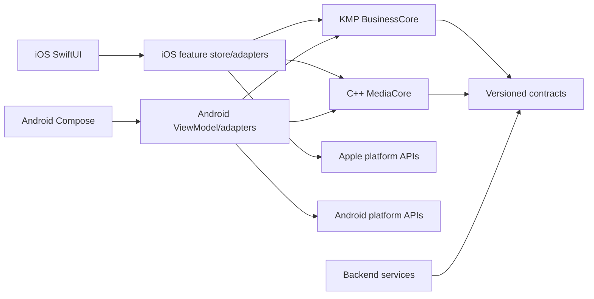

# Repository and Code Architecture

## 1. Architectural objective

Make product behavior identical where it must be shared and native where the operating system matters. Dependency direction points toward stable domain contracts; side effects point outward through ports.



BusinessCore and MediaCore do not depend on application UI or each other.

## 2. Ownership boundaries

| Layer | Owns | Does not own |
|---|---|---|
| Native presentation | Layout, navigation, focus, gestures, accessibility, permission UI, transient state | Protocol rules, signing order, ranking formulas |
| Native adapter/application | Task/scope lifetime, repositories, database transactions, OS effects, BusinessCore/MediaCore bridging | Cross-platform rule duplication |
| BusinessCore | Value types, Nostr codecs, reducers, validation, ranking, moderation, Studio semantics, publish decisions | UI, OS objects, secrets, decoded media, sockets/database implementations |
| MediaCore | Timeline math, scene/audio/render graph, deterministic media evaluation | Nostr, keys, wallet, network, product navigation |
| Backend | Rebuildable projection, search, candidate generation, jobs, moderation operations | Canonical identity/post ownership or private keys |
| Contracts | Schemas, event fixtures, API descriptions, render goldens | Runtime side effects |

## 3. Dependency rules

Allowed:

```text
Feature UI -> feature store -> BusinessCore use case/reducer
Feature store -> native repository adapter -> OS/database/network
Feature store -> media adapter -> MediaCore
Backend transport -> application use case -> projection/queue port
```

Forbidden:

```text
View -> SQL/WebSocket/Keychain/Keystore/C++ handle
BusinessCore -> SwiftUI/Compose/AVFoundation/Media3/Room/URLSession
MediaCore -> BusinessCore/Nostr/HTTP/database
Backend -> creator signing key
Feature A implementation -> Feature B private storage class
```

CI should eventually enforce these with module visibility and dependency analysis. Code review enforces them immediately.

## 4. Feature structure

iOS:

```text
Features/Publish/
├── PublishView.swift
├── PublishStore.swift
├── PublishViewState.swift
└── PublishAccessibility.swift
Platform/Publish/
├── IOSPublishJobStore.swift
├── BackgroundUploadAdapter.swift
└── BusinessPublishBridge.swift
```

Android:

```text
feature/publish/
├── PublishRoute.kt
├── PublishScreen.kt
├── PublishViewModel.kt
└── PublishUiState.kt
core/publish/
├── AndroidPublishJobStore.kt
├── UploadWorker.kt
└── BusinessPublishBridge.kt
```

BusinessCore:

```text
publish/
├── PublishState.kt
├── PublishAction.kt
├── PublishEffect.kt
├── PublishReducer.kt
├── PublishPolicy.kt
└── PublishReducerTest.kt
```

Create a module/package when it establishes a real visibility or build boundary. Do not create a module for every three-line model.

## 5. SRP applied to BitOS

One type, one reason to change:

- `BitzEventCodec`: NIP-71 representation changes.
- `PublishReducer`: legal publish transitions change.
- `BackgroundUploadAdapter`: OS background transfer behavior changes.
- `BlossomClient`: Blossom HTTP contract changes.
- `ProjectRepository`: local atomic persistence changes.
- `MediaRenderAdapter`: BusinessCore/MediaCore mapping changes.
- `FeedRanking`: ranking policy changes.
- `HomeView`: Home presentation changes.

Do not create `BitzManager`, `AppService`, `MediaHelper` or `NostrUtils`. Those names hide multiple reasons to change.

## 6. State and side effects

Business state uses action -> reducer -> new state + effects:

```text
user/native callback
    -> typed action
    -> pure BusinessCore reducer
    -> persist new revision
    -> execute emitted effect in native adapter
    -> dispatch typed result
```

Rules:

- Persist the new durable job state before starting a non-idempotent effect.
- Every effect carries an idempotency/input hash.
- Native feature stores own cancellation and lifecycle.
- Ignore stale effect results using job/project revision tokens.
- UI derives buttons/progress from state; it does not infer the state machine.

## 7. Composition roots

Construct dependencies once at the app/service boundary:

- iOS: `AppEnvironment.live()`.
- Android: application-level dependency container passed to ViewModel factories; replace with a DI tool only when constructor wiring becomes materially difficult.
- Services: process entry point creates config, telemetry, database, queue and use cases.

Dependencies are explicit constructor parameters. Tests replace ports with focused fakes. Avoid service locators and mutable global singletons.

## 8. Data ownership

- Nostr event: canonical after ID/signature verification.
- Media blob: canonical by SHA-256 hash; URLs are locations.
- Backend row: rebuildable projection unless explicitly operational.
- Draft/project/watch state: device-local by default.
- Publish job: durable local operational state.
- Queue/cache: never the only copy of accepted work.

Database records store typed identifiers, account scope and schema version. Large media remains in protected app files/object storage, not relational blobs.

## 9. Error architecture

Errors cross boundaries as stable codes:

```text
domain: invalid_transition, media_not_ready, hash_mismatch
platform: permission_denied, storage_full, background_expired
network: offline, timeout, rejected, rate_limited
protocol: invalid_event, invalid_signature, unsupported_nip
```

Each error declares retryability, safe user copy key and diagnostics fields. Never send raw exception text to UI or telemetry. Preserve the underlying error locally only when it is already redacted.

## 10. Concurrency

- One owner serializes each mutable resource: relay subscription registry, player pool, camera session, project writer and publish job.
- Swift actors and Kotlin structured scopes enforce ownership; C++ APIs document thread affinity.
- No detached/fire-and-forget tasks for durable work.
- A callback is invalid after its cancellation token/revision is superseded.
- Never hold a database transaction across network, signing or render work.

## 11. Architecture tests

Required over time:

- BusinessCore common tests and public API dump.
- iOS and Android adapter contract suites.
- MediaCore ABI/version and golden tests.
- Schema validation and migration corpus.
- Backend layering/import rule and integration tests.
- A repository structure check through `scripts/validate-structure.sh`.

## 12. Decision process

Create an ADR in `docs/adr/` when a choice changes a platform boundary, persistent schema, protocol profile, cloud provider, security model or supported OS. An ADR records context, decision, alternatives, consequences, rollout and rollback. Normal refactors do not need ADR ceremony.

