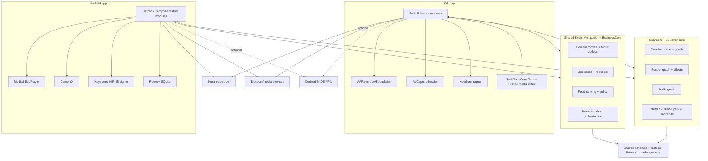

# Native Mobile and Editor Architecture

## 1. Target architecture



BusinessCore shares deterministic product behavior but not UI or platform resources. The C++ core is a library, never an application framework. Neither shared core can own screens, navigation, camera permissions, background scheduling, network reachability, key storage or app lifecycle. Their exact separation is defined in `shared-business-core.md`.

## 2. Platform baselines

Recommended starting baselines:

- iOS/iPadOS 17 or later, built with the current stable Xcode and Swift language mode.
- Android 10/API 29 or later, compiling against the current stable Android SDK.
- Physical-device performance lanes include a low supported device, a median device and a current flagship on each platform.

These baselines are product decisions, not library limitations. Lower them only after a device coverage and QA cost review. Never choose a lower baseline merely because an API can compile there.

## 3. Repository layout

```text
app-platform-nostr/
├── apps/
│   ├── ios/
│   │   ├── BitOSApp/
│   │   ├── Features/
│   │   ├── Platform/
│   │   ├── DesignSystem/
│   │   └── BitOSTests/
│   └── android/
│       ├── app/
│       ├── feature/
│       ├── core/
│       ├── benchmark/
│       └── baselineprofile/
├── shared/
│   └── business-core/
│       ├── src/commonMain/
│       ├── src/commonTest/
│       ├── src/androidMain/
│       ├── src/iosMain/
│       └── fixtures/
├── native/
│   └── media-core/
│       ├── include/bitos_media/
│       ├── src/model/
│       ├── src/timeline/
│       ├── src/render/
│       ├── src/audio/
│       ├── backends/metal/
│       ├── backends/vulkan/
│       ├── backends/gles/
│       ├── bindings/apple/
│       ├── bindings/android/
│       └── tests/
├── contracts/
│   ├── nostr/
│   ├── project-schema/
│   ├── api/
│   ├── render-goldens/
│   └── media-fixtures/
├── services/
├── infra/
└── docs/native/
```

Use one repository at the start so a schema or fixture change is validated against BusinessCore, both apps, MediaCore and the backend. Split only when release/security ownership demands it.

## 4. iOS stack

| Area          | Choice                                                  | Notes                                                                                                     |
| ------------- | ------------------------------------------------------- | --------------------------------------------------------------------------------------------------------- |
| UI            | SwiftUI, with small UIKit bridges                       | Native navigation, Dynamic Type, VoiceOver and platform conventions.                                      |
| Concurrency   | Swift structured concurrency and actors                 | Isolate relay pool, database writer, camera and upload coordinator.                                       |
| Architecture  | Native feature stores + KMP BusinessCore                | Swift stores own lifecycle/UI state; shared reducers/use cases own cross-platform product rules.          |
| Playback      | AVPlayer/AVQueuePlayer                                  | Custom feed coordinator bounds active players and preloads assets.                                        |
| Capture       | AVFoundation AVCaptureSession                           | Session configuration off main thread; capability-driven camera UI.                                       |
| Edit/export   | AVAsset/AVComposition, VideoToolbox, Metal, shared core | Native decode/encode; C++ evaluates scene/timeline and submits render work.                               |
| Audio         | AVAudioEngine + AVFoundation                            | Preview mix, voice recording, fades, ducking and metering.                                                |
| Persistence   | SQLite-backed app store plus file assets                | SwiftData/Core Data is acceptable for app records; project revisions remain explicit versioned documents. |
| Secrets       | Keychain with access control and biometric policy       | Store a local secret only when the user selected local signing.                                           |
| Networking    | URLSession and Network.framework                        | Background file upload/download uses a stable background session identifier.                              |
| Background    | BackgroundTasks + background URLSession                 | GPU rendering is foreground-bound; persist and resume cleanly.                                            |
| Notifications | APNs                                                    | Payload contains opaque routing identifiers, never decrypted DM text.                                     |
| Tests         | XCTest, Swift Testing where stable, XCUITest, MetricKit | Include performance, memory, thermal and crash diagnostics.                                               |

AVFoundation is the source of truth for capture and platform export. Metal preview/export stops when the app backgrounds because iOS does not permit ongoing background GPU submission. The queue persists an exact checkpoint before suspension. Uploads use file-backed background URLSession tasks, not in-memory body streams.

## 5. Android stack

| Area          | Choice                                                               | Notes                                                                                |
| ------------- | -------------------------------------------------------------------- | ------------------------------------------------------------------------------------ |
| UI            | Kotlin + Jetpack Compose + Material 3 primitives                     | Custom BitOS design tokens over native semantics and accessibility.                  |
| Concurrency   | Coroutines, Flow and structured scopes                               | No process-global unmanaged jobs.                                                    |
| Architecture  | Native feature stores + KMP BusinessCore                             | ViewModels own lifecycle/UI state; shared reducers/use cases own product rules.      |
| Playback      | Media3 ExoPlayer                                                     | Player pool, preloading, cache and device codec fallback policy.                     |
| Capture       | CameraX, with Camera2 interop only where required                    | Capability-driven controls and lifecycle-safe recording.                             |
| Edit/export   | Media3 Transformer/MediaCodec + shared core                          | Transformer for simple paths; shared compositor for multi-layer parity.              |
| Audio         | AudioRecord/AudioTrack and Media3 processors                         | Separate project tracks and deterministic mix automation.                            |
| Persistence   | Room/SQLite + app-scoped files                                       | Work and account records are transactional and migratable.                           |
| Secrets       | Android Keystore + encrypted envelope                                | NIP-55 external signer is preferred when present; do not export Keystore keys.       |
| Networking    | OkHttp-compatible HTTP/WebSocket layer                               | Pinning is not a default; use normal PKI, strict TLS and host allow/policy controls. |
| Background    | WorkManager + foreground service for user-visible long work          | Respect Android background and notification rules.                                   |
| Notifications | FCM                                                                  | Opaque routing data only; app fetches/verifies public events.                        |
| Tests         | JUnit, instrumented Compose tests, Macrobenchmark, Baseline Profiles | Include vendor/device codec matrix and low-memory kills.                             |

Media3 Transformer is the first choice for trim/transcode and supported effects because it uses platform MediaCodec and supports preview through ExoPlayer. The C++ compositor is used when the project contains multiple visual layers, custom BitOS effects, drawing, complex transitions or parity-sensitive meme rendering.

## 6. Dependency policy

- Pin dependencies through lockfiles/version catalogs and review release notes monthly.
- Prefer platform APIs for camera, playback, background work, key storage and accessibility.
- Every cryptography or Nostr dependency needs known maintainers, test vectors, license review and a replacement seam.
- FFmpeg is allowed in isolated server workers. Embedding it in mobile requires a separate codec/patent/LGPL/GPL legal decision and is not the default architecture.
- Kotlin Multiplatform is required for pure business behavior and orchestration. It must not own UI, platform lifecycle, secure storage, camera/player, background scheduling or C++ resource lifetime.
- Consume BusinessCore on iOS through the established Kotlin/Native Apple framework interop and a small Swift facade. Swift Export remains optional until officially stable and release-tested.
- BusinessCore and MediaCore communicate only through native adapters and the validated project/render contracts; do not create a nested KMP-to-C++ callback stack.
- Never load executable code, native plugins, JavaScript or arbitrary shaders from a Nostr event.

## 7. Module boundaries

BusinessCore defines the domain interfaces below; iOS and Android provide native adapters:

```text
IdentitySigner
RelayPool
EventVerifier
NostrRepository
FeedRepository
ProfileRepository
MessageRepository
WalletRepository
MediaResolver
UploadCoordinator
ProjectRepository
EditorSession
PublishCoordinator
ModerationPolicy
AnalyticsConsent
```

Rules:

- Views cannot sign or publish directly.
- Native feature stores own scopes, focus/navigation and transient UI state; BusinessCore owns shared reducers/use cases.
- Network DTOs do not enter views; map to verified domain types.
- The relay layer returns verification results, provenance and relay receipts.
- The editor never knows an `nsec` or wallet credential.
- The publish coordinator accepts a ready media descriptor and an unsigned event, then asks the signer at the final stage.
- Backend responses containing Nostr events are untrusted until normal client verification passes.

## 8. Local data and files

Account-scoped database tables/collections:

```text
accounts                 signer type, pubkey, display configuration
relay_configs            url, read/write role, health, last error
events                   id, pubkey, kind, created_at, tags/content, verified
replaceable_heads        coordinate -> selected event id
profiles                 derived profile projection
feed_items               surface, event ref, rank fields, cursor
social_state             follows, mutes, bookmarks, reactions
messages                 encrypted envelope + local decrypted projection
projects                 project header and active revision
project_revisions        schema, revision, document hash, file path
assets                   local id, hash, type, path, ownership, refcount
jobs                     render/upload/publish state machine checkpoint
relay_receipts           event id, relay, status, timestamp
watch_state              local position and aggregate interest update
downloads                media hash, rendition, bytes, eviction class
```

Large sources, proxies, waveforms, thumbnails and outputs live in app-scoped files, not database blobs. Store a content hash, size, MIME, file protection class, reference count and last access. Atomic project save writes a new document, fsync/close, then updates the database pointer in one transaction. Garbage collection only deletes unreferenced assets after a recovery grace period.

Never cache decrypted DMs or keys in shared logs, notification payloads, system pasteboards beyond the direct user action, unprotected thumbnails or cloud backup by accident.

## 9. Shared project schema

The project is a versioned, nondestructive instruction graph. Use integer microseconds internally in the C++ core; public JSON may use integer milliseconds where inherited web compatibility requires it. Convert once at the boundary and never use floating-point time as an identity.

```json
{
  "schema": "com.bitos.studio.project",
  "version": 1,
  "projectId": "uuid",
  "canvas": { "width": 1080, "height": 1920, "fpsNum": 30, "fpsDen": 1 },
  "durationUs": 12000000,
  "tracks": [],
  "assets": [],
  "output": { "video": "h264", "audio": "aac", "container": "mp4" },
  "createdAt": 0,
  "updatedAt": 0
}
```

Required concepts:

- immutable asset identity by hash plus local/remote locators;
- clip source range, timeline range, transforms, crop and rate;
- typed visual/audio/drawing/caption/effect tracks;
- normalized spatial coordinates with declared anchor/fit policy;
- deterministic z-order, blend mode and color-space behavior;
- explicit capability requirement per effect/template;
- safe unknown-field preservation or ignore policy;
- hard byte, layer, point, duration and recursion limits;
- migrations that are pure, fixture-tested and never overwrite the only user copy.

The web `com.bitos.bitz.meme` schema gets an importer. It must not become the full native project model because it cannot represent the planned multi-track editor cleanly.

## 10. C++ media core

### 10.1 Responsibilities

- parse/validate the shared project model into an immutable scene snapshot;
- timeline time mapping, clip selection, animation curves and snapping math;
- transform/crop/opacity/blend evaluation;
- deterministic text/sticker/drawing/effect scene commands;
- render graph construction and GPU resource lifetime;
- audio automation graph and sample-accurate cue scheduling;
- capability query and graceful fallback report;
- serialization compatibility tests and preview/export conformance.

### 10.2 Non-responsibilities

- camera device selection and permissions;
- file picker and photo library;
- Nostr, Blossom, wallet or API networking;
- local key access;
- app database, notifications, navigation or OS background work;
- final policy decisions such as whether content may publish.

### 10.3 Platform boundary

Expose a small stable C ABI, then wrap it in Swift/Objective-C++ and JNI/Kotlin. Do not expose STL types, exceptions or ownership ambiguity across the ABI. Handles are opaque; every create has a destroy; strings/buffers carry explicit length; callbacks declare thread and lifetime guarantees.

```c
bitos_status bitos_project_open(const uint8_t *json, size_t len, bitos_project **out);
bitos_status bitos_session_create(bitos_project *, const bitos_caps *, bitos_session **out);
bitos_status bitos_session_render(bitos_session *, int64_t time_us, bitos_surface target);
bitos_status bitos_session_audio(bitos_session *, int64_t start_us, uint32_t frames,
                                 float *interleaved);
void bitos_session_destroy(bitos_session *);
```

The real header will include ABI version, structured errors, cancellation, diagnostics and thread-safe reference rules.

### 10.4 Rendering backends

- Apple: Metal texture/pixel-buffer interop with AVFoundation/VideoToolbox.
- Android preferred: Vulkan where capability and driver tests pass.
- Android fallback: OpenGL ES for the supported baseline.
- CPU reference renderer: slow, deterministic test oracle for a bounded subset.

Do not promise bit-identical GPU pixels across vendors. Define tolerances: exact structural/timing output, bounded per-pixel delta, SSIM threshold, audio sample/timing tolerance and manually reviewed golden changes.

### 10.5 Text and assets

Text layout must use the same bundled/licensed fonts, shaping rules, line breaking and fallback mapping on both platforms. Rasterize unsupported remote vector assets in a sandbox before the render graph. Decode images with pixel and memory budgets. Animated GIF/video stickers become bounded decoded frame streams; they are not executed content.

## 11. Playback architecture

Maintain at most three prepared player slots around the visible index. Only the visible item may render audio. A player lease contains event ref, selected rendition, fallback position, poster and playback token. When the cell identity changes, the token prevents stale callbacks from updating a reused view.

Rendition policy inputs:

- viewport pixels and scale;
- network type, data saver and user quality;
- codec/HDR capability;
- measured throughput and startup/stall history;
- cached bytes and available mirrors.

On failure, try the next URL for the same rendition, then a lower rendition, then content-hash discovery. Report aggregate reason codes without leaking full private URLs or user content.

## 12. Capture and editor clocks

Capture segments record media presentation timestamps from the platform pipeline. Editor actions use a monotonic clock. Wall-clock time is metadata only. Every recording take stores synchronization anchors for source video, microphone, camera PIP, strokes and live sound cues.

Preview uses a host clock controlled by the native player/audio system. Export pulls exact frame times from the timeline at `frameIndex * fpsDen / fpsNum` and exact audio sample ranges. Never drive final export from UI display-link callbacks.

## 13. Publish state machine

```text
draft
  -> validating
  -> rendering
  -> hashing
  -> uploading
  -> verifying_remote
  -> event_ready
  -> awaiting_signature
  -> publishing
  -> reconciling
  -> done
```

Terminal alternatives: `cancelled`, `blocked` or `failed_retryable/failed_final` with a stable error code. Each transition commits input hashes, output descriptors and attempts before starting its effect. Rerunning a completed stage is a no-op when its input hash matches. Editing after render changes the project hash and invalidates downstream stages.

The web publish machine is a behavioral seed, but native adds durable render/hash/upload checkpoints, signer waiting, multiple relay receipts and background transfer reconciliation.

## 14. Performance budgets

Initial budgets are targets to validate, not marketing claims:

| Metric                                                     |                                                     Target |
| ---------------------------------------------------------- | ---------------------------------------------------------: |
| Cold launch to usable cached feed, median reference device |                                                    < 1.5 s |
| Feed gesture-to-next-frame presentation                    |                          one display frame in steady state |
| Cached poster display                                      |                                                   < 100 ms |
| First frame on good network, median                        |                                                    < 1.5 s |
| Steady feed playback dropped frames                        |                             < 1% on reference media/device |
| Editor touch-to-preview response                           |                                < 50 ms for simple projects |
| Timeline scrub presentation                                |             60 Hz UI, decoded preview as soon as available |
| Memory with three feed slots                               |       device-tier budget; no unbounded decoded frame cache |
| 30 s 1080p simple export                                   | establish per-device baseline and prevent >20% regressions |
| Audio/video sync drift                                     |               < 40 ms at end of a 60 s conformance project |

Instrument with signposts/MetricKit on iOS and tracing/Macrobenchmark on Android. Averages alone are insufficient; monitor p50/p95, device model, OS, codec and project complexity.

## 15. Security boundary

- Local signer methods accept typed unsigned events and return a verified signed event.
- Unlock prompts happen as late as possible and never expose secret bytes to UI state.
- C++ parsers treat every project/template/media descriptor as hostile input.
- JNI/Swift wrappers validate sizes before allocation and map all native failures to typed errors.
- Crash dumps and logs exclude project JSON, captions, URLs with credentials, DM plaintext, wallet payloads and authorization events.
- Universal/deep links are parsed with an allowlist and cannot trigger signing, payment or joining a call without confirmation.
- Clipboard imports and QR scans show the interpreted operation before action.

## 16. Architecture decision gates

Before expanding the shared core, complete three spikes:

1. One 1080x1920 video + timed text + sticker + filter previews and exports on both platforms from the same project fixture.
2. Trim/split/audio/SFX output remains within timing and visual tolerances across reference devices.
3. The ABI survives cancellation, app backgrounding, device rotation, low memory and repeated open/close without leaks.

If a platform API is faster and behaviorally equivalent for a simple project, use it. The shared core is for parity and complexity, not a mandate to replace efficient native operations.

## 17. Primary engineering references

- Apple [AVCam camera sample](https://developer.apple.com/documentation/avfoundation/avcam-building-a-camera-app) and [capture-session setup](https://developer.apple.com/documentation/avfoundation/setting-up-a-capture-session).
- Apple [AVVideoComposition](https://developer.apple.com/documentation/avfoundation/avvideocomposition) and [AVVideoCompositing](https://developer.apple.com/documentation/avfoundation/avvideocompositing) for custom composition.
- Apple [background URLSession transfers](https://developer.apple.com/documentation/foundation/downloading-files-in-the-background) and [Metal background restrictions](https://developer.apple.com/documentation/metal/preparing-your-metal-app-to-run-in-the-background).
- Apple [Keychain Services](https://developer.apple.com/documentation/security/keychain-services).
- Android [Media3](https://developer.android.com/media/media3), [Transformer](https://developer.android.com/media/media3/transformer) and [transformations](https://developer.android.com/media/media3/transformer/transformations).
- Android [CameraX](https://developer.android.com/media/camera/camerax), [WorkManager](https://developer.android.com/topic/libraries/architecture/workmanager) and [Android Keystore](https://developer.android.com/privacy-and-security/keystore).

Re-check these references and the supported OS/device matrix at every major release. Do not freeze framework versions in this blueprint; pin exact versions in build files and dependency manifests where automated tooling can keep them current.
