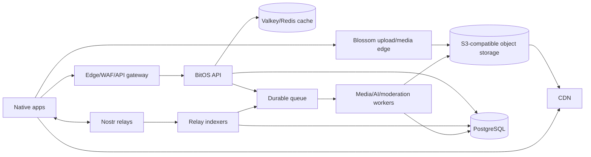

# Nostr Protocol and Infrastructure

## 1. System rule

BitOS is a Nostr client first and a BitOS-assisted product second.

- Canonical public state: valid signed Nostr events and content-addressed media.
- Rebuildable state: API projections, counters, search documents, recommendation features and moderation scores.
- Device-private state: secret keys, decrypted messages, drafts, detailed watch history, interest vectors and unpublished media.
- Operational state: upload/transcode jobs, relay cursors, delivery receipts and abuse controls.

A BitOS database row is never proof that an event exists or is authentic. Apps and indexers verify the NIP-01 ID and Schnorr signature, validate kind/tag constraints, and retain provenance.

## 2. Recommended deployment

Start with a modular monolith codebase deployed as independently scalable processes:



Reference production stack:

| Layer         | Recommended starting choice                                              | Why                                                                |
| ------------- | ------------------------------------------------------------------------ | ------------------------------------------------------------------ |
| Edge          | Managed DNS, TLS, CDN, WAF and rate limiting                             | Absorb abusive traffic and cache immutable media.                  |
| API/indexer   | TypeScript on Node.js LTS with Fastify, or Go if the team owns it better | Good Nostr/websocket ecosystem; modular monolith first.            |
| Database      | Managed PostgreSQL with point-in-time recovery                           | Durable projections, jobs metadata, moderation and analytics.      |
| Cache         | Managed Valkey/Redis                                                     | Candidate/cache/rate-limit acceleration, never canonical storage.  |
| Queue         | Managed durable queue with visibility timeout and dead-letter queue      | Media jobs must survive process and cache loss.                    |
| Object        | S3-compatible storage behind a Blossom service and CDN                   | Hash-addressed blobs, lifecycle, replication and predictable cost. |
| Media workers | Autoscaled Linux containers with FFmpeg/ffprobe                          | Isolate untrusted parsing/transcode and scale CPU/GPU separately.  |
| Search V1     | PostgreSQL full-text + trigram                                           | Avoid a second datastore before scale requires it.                 |
| Search V2     | OpenSearch/Meilisearch plus pgvector only with measured need             | Transcript, semantic and high-cardinality search at scale.         |
| Observability | OpenTelemetry traces/metrics/logs + error tracking                       | Vendor-neutral instrumentation and correlation.                    |
| IaC           | Terraform/OpenTofu                                                       | Reproducible environments, review and recovery.                    |

Use one primary cloud for compute, PostgreSQL, queue and object storage during V1. Adding an edge vendor or second object provider is useful for availability, but a multi-cloud control plane before launch increases incident complexity. Blossom multi-home supplies media portability without forcing every service to be multi-cloud.

Kubernetes, ClickHouse, Kafka and a service mesh are not V1 requirements. Adopt each only after a measured limit, owner and migration plan exist.

## 3. Service boundaries

```text
services/
├── api              feed candidates, search, public aggregates, job bootstrap
├── indexer          relay subscriptions, verification, projections, cursors
├── media            Blossom-compatible blob upload/retrieval/auth
├── worker           probe, transcode, poster, waveform, captions, scanning
├── notifier         APNs/FCM opaque notifications and preference enforcement
└── admin            moderation/operations UI with strong authentication
```

They may share a repository, protocol package, migrations and deployment tooling. They must use distinct production identities and least-privilege database/object/queue roles.

## 4. Nostr support matrix

The canonical references are the current [NIPs repository](https://github.com/nostr-protocol/nips) and [Blossom BUD repository](https://github.com/hzrd149/blossom). Several media/comment specifications are draft/optional; isolate their codecs and gate publishing separately from reading.

| Concern            | Specification / kind                                                                       | Native policy                                                                        |
| ------------------ | ------------------------------------------------------------------------------------------ | ------------------------------------------------------------------------------------ |
| Event format/relay | NIP-01                                                                                     | Required; verify ID/signature and relay messages.                                    |
| Profile/follows    | NIP-01 kind 0, NIP-02 kind 3                                                               | Required.                                                                            |
| Deletion           | NIP-09 kind 5                                                                              | Honor only valid author deletion; retain audit tombstone in projection.              |
| Text threads       | NIP-10 kind 1                                                                              | Read/write for note replies, not new video comments.                                 |
| References/URI     | NIP-19 and NIP-21                                                                          | Strict parser, universal links and QR.                                               |
| Comments           | [NIP-22 kind 1111](https://github.com/nostr-protocol/nips/blob/master/22.md)               | New video comments use uppercase root and lowercase parent tags with K/k.            |
| Reposts            | NIP-18 kinds 6/16                                                                          | Kind 16 for media/custom events; retain kind 6 note support.                         |
| Reactions          | NIP-25 kind 7                                                                              | Validate target and author tags.                                                     |
| Private messages   | NIP-17 + NIP-44 + NIP-59                                                                   | Required before calling DMs secure; legacy NIP-04 is import/read compatibility only. |
| Remote signing     | [NIP-46](https://github.com/nostr-protocol/nips/blob/master/46.md)                         | Support bunker/nostrconnect, permission scopes, relay switching and logout cleanup.  |
| Relay search       | [NIP-50](https://github.com/nostr-protocol/nips/blob/master/50.md)                         | REQ pair: base `#t` + recent-sample everywhere, NIP-50 `search` as its own subscription (several relays reject any REQ carrying `search`); always re-match locally. |
| Android signing    | [NIP-55](https://github.com/nostr-protocol/nips/blob/master/55.md)                         | Preferred Android external signer integration.                                       |
| Zaps               | [NIP-57](https://github.com/nostr-protocol/nips/blob/master/57.md)                         | Validate zap request/receipt and invoice binding.                                    |
| Relay lists        | [NIP-65](https://github.com/nostr-protocol/nips/blob/master/65.md)                         | Outbox-aware author reads and advertised user write relays.                          |
| Pictures           | NIP-68 kind 20                                                                             | Read/write image posts and MEM image output.                                         |
| Video              | [NIP-71 kinds 21/22/34235/34236](https://github.com/nostr-protocol/nips/blob/master/71.md) | Kind 22 default; read all four plus legacy video-bearing kind 1.                     |
| App data           | NIP-78 kind 30078                                                                          | Namespaced BitOS template/sound/effect envelope until a proven open kind exists.     |
| HTTP auth          | NIP-98                                                                                     | API auth and replay-resistant scoped requests where applicable.                      |
| Media metadata     | [NIP-92 `imeta`](https://github.com/nostr-protocol/nips/blob/master/92.md)                 | Authoritative media descriptors, hashes, dimensions, MIME and fallbacks.             |
| Media upload       | NIP-96                                                                                     | Compatibility provider only; Blossom is preferred.                                   |
| Wallet             | NIP-47 Nostr Wallet Connect                                                                | Request minimal methods; separate wallet and identity sessions.                      |

Record a `supported`, `read-only`, `write-enabled`, `experimental` or `disabled` status per NIP in the app About screen and server capability endpoint.

## 5. Video event profile

For an immutable short video, publish regular kind 22. Use kind 34236 only when the product deliberately promises addressable replacement semantics. Addressable events require a stable `d` tag and correct latest-event selection.

```json
{
  "kind": 22,
  "created_at": 0,
  "content": "Caption and primary URL for compatible clients",
  "tags": [
    ["title", "Short title"],
    ["published_at", "0"],
    ["alt", "Accessible description"],
    ["t", "nostr"],
    [
      "imeta",
      "url https://media.example/<sha256>.mp4",
      "m video/mp4",
      "x <lowercase-sha256>",
      "dim 1080x1920",
      "duration 12.34",
      "image https://media.example/<poster-sha256>.jpg",
      "fallback https://mirror.example/<sha256>.mp4"
    ],
    ["client", "BitOS", "<client-address>"]
  ]
}
```

Codec rules:

- `imeta` is authoritative; a bare content URL is legacy compatibility.
- Validate hashes, dimensions, duration, MIME and URL syntax with hard bounds.
- Multiple actual renditions are separate `imeta` variants according to the current NIP-71/NIP-92 form; mirror URLs are fallbacks for the same bytes.
- Keep protocol construction in Kotlin Multiplatform BusinessCore and run the same golden fixtures through common, iOS-framework, Android and server verification lanes.
- Do not invent tag syntax in feature code. Propose BitOS extensions in a versioned profile document with examples and parsers.
- A reader ignores unknown safe tags and does not reject a playable event for optional metadata it does not understand.

## 6. Comments and interaction targets

New comments on a regular kind-22 event use kind 1111 with:

```text
root:   ["E", video-id, relay-hint, video-author], ["K", "22"], ["P", video-author]
parent: ["e", parent-id, relay-hint, parent-author], ["k", parent-kind], ["p", parent-author]
```

For a top-level comment, parent is the video itself. For a nested reply, uppercase tags remain the root video and lowercase tags identify the immediate parent comment. Addressable video uses `A/a` coordinate tags and should also retain the concrete event reference when the current spec calls for it.

New media reposts use generic repost kind 16. Reactions and zaps target the exact event/address defined by their NIP. Delete, edit, count and notification code all use typed `EventRef`; no subsystem should infer identity from a media URL.

## 7. BitOS extension envelope

Templates, sounds and effect descriptions begin as NIP-78 kind 30078 app data:

```json
{
  "kind": 30078,
  "content": "{\"schema\":\"com.bitos.studio.template\",\"version\":1}",
  "tags": [
    ["d", "com.bitos.studio:template:<stable-id>"],
    ["type", "video-template"],
    ["name", "Boom Zoom"],
    ["t", "funny"]
  ]
}
```

Every asset descriptor includes schema/version, creator pubkey, immutable hash, media URLs, preview, license identifier, attribution, provenance, engine capability minimum and bounded parameter data. Price is descriptive until a payment receipt/unlock protocol is specified.

Remote descriptions select only built-in effect IDs and bounded parameters. Unknown effects show as unsupported; they never download code or a shader.

Before seeking a dedicated kind/NIP, publish the schema, fixtures, threat model and at least one independent implementation.

## 8. Remix and value graph

A published remix carries standard event/author references plus a versioned BitOS edge:

```text
["e", parent-event-id, relay-hint, "root"]
["p", parent-author, relay-hint]
["bitz:edge", "remix", "event:<parent-event-id>", "1"]
["bitz:asset", "sound", "<asset-ref>", "<creator-pubkey>"]
["bitz:asset", "template", "<asset-ref>", "<creator-pubkey>"]
```

The indexer projects these into a DAG and rejects cycles in its derived graph without claiming it can invalidate valid signed events. Attribution is not proof of copyright permission. The editor shows source, license and attribution before use and preserves them through export/publish.

Value splits are proposals over roles such as creator, remix parent, sound creator, template creator and curator. Validate totals to 10,000 basis points. V1 payments may be sequential and partially fail, so the receipt UI shows each transfer independently.

## 9. Blossom media

Use the current Blossom protocol:

- [BUD-01](https://github.com/hzrd149/blossom/blob/master/buds/01.md) for hash-addressed blob retrieval/server behavior.
- BUD-02 upload/delete/list operations as implemented by the chosen server.
- [BUD-03](https://github.com/hzrd149/blossom/blob/master/buds/03.md) kind 10063 server lists.
- BUD-04 mirroring for multi-home workflows.
- BUD-05 media optimization only when output descriptors remain verifiable.
- [BUD-11](https://github.com/hzrd149/blossom/blob/master/buds/11.md) authorization where supported.

Media rules:

1. Hash local final bytes with SHA-256.
2. Use short-lived, method/hash/server-scoped authorization.
3. Upload to a selected Blossom-compatible service.
4. Retrieve/HEAD and verify descriptor, length and hash policy.
5. Generate or await required poster/renditions.
6. Mirror critical output when the selected policy requires it.
7. Only then construct and sign the media event.

The CDN key is the blob hash and immutable. Never overwrite different bytes at the same URL. Use long cache lifetime with immutable headers; deletion and legal takedown operate through origin policy/purge without changing the meaning of the hash.

## 10. Media pipeline

Two supported paths:

### Device-rendered V1

```text
native editor -> final MP4/poster -> local hash -> Blossom upload -> verify -> sign -> relay publish
```

This minimizes backend dependence and keeps source media private. The native app estimates storage as source + proxies + render scratch + output and prevents starting when the safe budget is unavailable.

### Server-assisted production media

```text
source/final upload -> quarantine -> probe/scan -> transcode ladder/poster/waveform
-> hash outputs -> publish to Blossom/object origin -> ready descriptor
-> app verifies descriptor -> signs event -> relays
```

The server never signs the creator's video event. Jobs are idempotent by `(input_hash, recipe_version)`. Worker output is immutable. The ready response includes exact URLs, hashes, sizes, MIME, dimensions, duration and recipe version.

Recommended public short-video output:

- compatibility master: MP4, H.264/AVC, AAC-LC, `yuv420p`, fast-start metadata;
- poster: JPEG or WebP with explicit hash and dimensions;
- optional MP4 renditions at 360p/540p/720p/1080p based on source;
- optional HLS for BitOS playback, but never as the sole interoperable media URL;
- preserve or tone-map HDR according to a declared policy; do not silently destroy color.

All untrusted parsing happens in a sandboxed worker without broad network or credentials. Apply limits before and during decode: bytes, duration, dimensions, frame rate, tracks, metadata, decoded pixels, CPU time and output count.

## 11. Relay architecture

Client pools distinguish:

- account read/write relays from local settings and NIP-65;
- discovery relays selected for media/index coverage;
- DM/remote-signer relays according to their protocols;
- paid/special relays with explicit user setup.

Write success requires at least one valid relay `OK`; the app records every attempted result and keeps retryable receipts. Reads deduplicate by event ID, select replaceable heads correctly, cap subscriptions and cancel stale feed pages.

Indexers shard subscriptions, persist cursors/overlap windows and treat delivery as at-least-once. Projection writes are idempotent. Keep raw verified public event JSON for rebuild according to retention policy. A full rebuild into an empty schema is a release-tested operation.

Do not run the only public relay as an undocumented app database. If BitOS operates relays, publish retention, accepted kinds, size limits, payment, moderation and availability policy.

## 12. API contracts

The API returns derived candidates and signed events, never a proprietary post object as canonical truth.

Core endpoints:

```text
GET  /v1/feed/{surface}?cursor=&limit=
GET  /v1/search?q=&type=&cursor=
GET  /v1/events/{id}/context
GET  /v1/media/{hash}/status
POST /v1/media/jobs
GET  /v1/media/jobs/{id}
POST /v1/analytics/batches
GET  /v1/creator/{pubkey}/aggregates
GET  /v1/capabilities
```

Feed items contain the signed event, relay hints, optional verified media summary and an explainable score breakdown. Pagination uses an opaque stable cursor, not a page number. Every mutating/authenticated endpoint uses a replay-resistant short-lived Nostr authorization profile, idempotency key and typed error.

The client can ignore server parsing and reparse the event itself. A server-provided event with invalid ID/signature is a security incident.

## 13. Data stores

PostgreSQL domains:

- verified raw events, relay observations and replaceable heads;
- profiles, follows, mutes, media/video projection and interaction edges;
- comment/repost/reaction/zap aggregates with provenance;
- remix/template/sound/value graph;
- search documents and feed features;
- media job, output descriptor and object health;
- moderation case, rule result and appeal;
- notification registration/preferences with minimal device data;
- privacy-bounded analytics batches and aggregates.

Redis/Valkey stores only expiring cache, rate limits, hot candidate sets and coordination that can be reconstructed. Durable jobs reside in the managed queue plus PostgreSQL job state. Object storage holds source/output according to explicit lifecycle; it never holds identity keys.

## 14. Ranking and analytics

Candidate API ranking can use public event data and privacy-safe aggregates. Final device ranking combines local behavior and user controls. Every score component has an identifier, default weight, normalization and explanation string.

Guardrails:

- filter invalid, deleted, muted, blocked and policy-hidden events before rank;
- cap repeat authors/sounds/topics;
- distinguish verified receipts from raw engagement claims;
- damp suspected coordinated/bot activity;
- reserve exploration inventory;
- allow chronological Latest with no hidden engagement reorder;
- expose reset/export controls for local preferences.

Analytics is opt-in by policy/region and data-minimized. Use random installation-scoped identifiers, batching, coarse timing buckets and short raw retention. Never upload frame-by-frame watch logs, search text, contacts, DMs, drafts or creator source media by default.

## 15. Environments and CI/CD

Environments:

- local: containerized relay, Blossom, PostgreSQL, Valkey, object store, queue emulator, API, indexer and worker;
- staging: isolated production-like accounts/domains/buckets using synthetic identities;
- production: managed multi-AZ data services, autoscaled stateless compute and reviewed access.

Required pull-request checks:

- iOS build/unit tests and Android build/unit tests;
- C++ sanitizers, static analysis and native unit/golden tests;
- Nostr fixture tests in BusinessCore, both platform adapter lanes and the server;
- API schema compatibility and database migration test;
- media fixture/transcode conformance;
- secret, dependency, license and container vulnerability scans;
- infrastructure plan and policy checks when infra changes.

Deployment uses immutable artifacts, expand/contract migrations, staging smoke, approval, canary/rolling production and automated rollback signals. Servers support the current mobile version and at least one prior supported contract version.

Feature flags/kill switches include publishing, server transcode, a problematic codec/device class, analytics upload, For You API, notifications, multi-home, AI and marketplace extensions. A kill switch cannot disable direct relay export/access to a user's local identity or drafts.

## 16. Reliability and operations

Initial service objectives to validate:

| Signal                       |                              Launch target |
| ---------------------------- | -----------------------------------------: |
| Cached feed API availability |                              99.9% monthly |
| Cached feed API latency      |                p95 < 250 ms at edge region |
| Search latency               |                 p95 < 500 ms for V1 corpus |
| Accepted durable jobs lost   |                                          0 |
| Relay index freshness        | measured per relay; alert on sustained lag |
| Ready media hash mismatch    |      0 tolerated; page security/operations |
| Push notification enqueue    |              p95 < 60 s from indexed event |

Dashboards cover API RED metrics, relay lag/duplicates, signature failures, queue age/retries/dead letters, worker failure by recipe/input class, object/CDN errors, Blossom authorization failures, media verification, push rejection, database saturation and privacy pipeline volume.

Runbooks cover:

- API/DB/cache/queue/object outage;
- relay flood or malformed-event attack;
- stuck/poison media job;
- media host compromise or hash mismatch;
- leaked service credential;
- notification credential failure;
- projection rebuild;
- backup restore and regional recovery;
- app kill switch and forced minimum version only for true security emergencies.

Set and test RPO/RTO before public launch. PostgreSQL needs point-in-time recovery and restore drills. Object versioning/retention follows legal and user deletion policy. Redis is never a backup.

## 17. Threat model summary

Protect against:

- stolen local or remote signer credentials;
- replayed Blossom/API authorization;
- invalid/malleated Nostr events and replacement confusion;
- malicious relay floods, oversized filters/events and subscription leaks;
- hostile media parsers, decompression bombs and codec exploits;
- executable template/effect content;
- SSRF through remote media import and worker callbacks;
- object bucket enumeration, overwrite or origin bypass;
- payment invoice substitution and forged zap display;
- DM metadata leakage through push/analytics/logs;
- deep-link/QR operation confusion;
- supply-chain and CI credential compromise.

Formal threat reviews are release gates for local signer, remote signer, NIP-55, media import/processing, DMs, wallet, calls, AI uploads and admin moderation.
